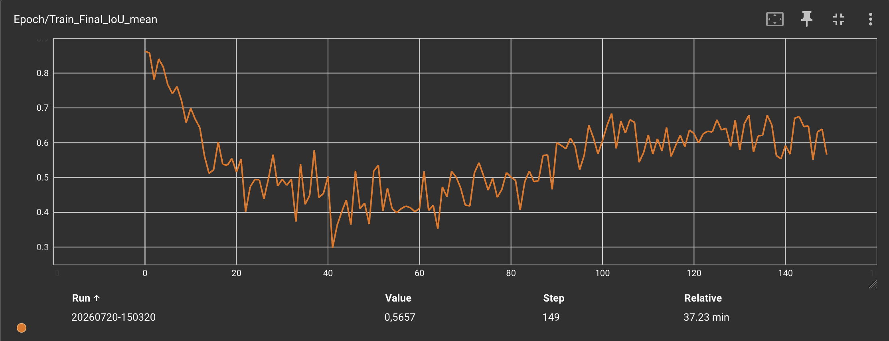
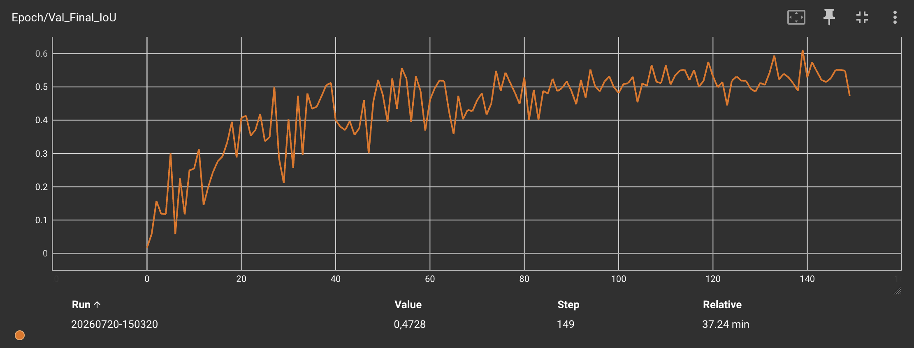

# Localizzazione di tumori cerebrali da MRI mediante Reinforcement Learning con Imitation Learning guidato

## Relazione di Progetto di Sistemi Complessi: Modelli e Simulazione di Pina Lorenzo 894396 e Rancati Simone 900052

Repository Github: https://github.com/LorenzoPinaUnimib/segmentation_rl

## Indice
1. [Introduzione](#1-introduzione)
2. [Dataset](#2-dataset)
3. [Formulazione del problema](#3-formulazione-del-problema)
4. [Metodologia](#4-metodologia)
   1. [Modello backbone](#41-modello-backbone)
   2. [Rete decisionale](#42-rete-decisionale)
   3. [Spazio delle azioni](#43-spazio-delle-azioni)
5. [Metriche di sovrapposizione](#5-metriche-di-sovrapposizione)
   1. [Intersection over Union (IoU)](#51-intersection-over-union-iou)
   2. [Complete Intersection over Union (CIoU)](#52-complete-intersection-over-union-ciou)
6. [Reward shaping](#6-reward-shaping)
   1. [Ricompensa per miglioramento progressivo](#61-ricompensa-per-miglioramento-progressivo)
   2. [Penalità per step](#62-penalità-per-step)
   3. [Ricompensa/punizione alla terminazione (azione stop)](#63-ricompensa-punizione-alla-terminazione-azione-stop)
   4. [Penalità per troncamento](#64-penalità-per-troncamento)
   4. [Reward clipping](#65-reward-clipping)
7. [Strategie di addestramento considerate](#7-strategie-di-addestramento-considerate)
   1. [Reinforcement Learning puro](#71-reinforcement-learning-puro)
   2. [Curriculum Learning](#72-curriculum-learning)
   3. [Imitation Learning con probabilità di guida (Teacher prob)](#73-imitation-learning-con-probabilità-di-guida-teacher-prob)
   4. [Prioritized Experience Replay](#74-prioritized-experience-replay)
8. [Risultati](#8-risultati)
9. [Conclusioni](#9-conclusioni)

---

## 1. Introduzione

Il progetto affronta il problema della localizzazione di un tumore cerebrale in immagini di risonanza magnetica (MRI) mediante metodi di Reinforcement Learning (RL).

L’agente riceve in input l’immagine e la posizione corrente di un bounding box e ad ogni passo temporale sceglie un’azione per aggiornare il bounding box, fino a farlo coincidere il più possibile con l’area occupata dal tumore.

L’interazione tra agente ed ambiente può essere modellata tramite un processo decisionale markoviano (MDP), caratterizzato da uno spazio degli stati, uno spazio delle azioni, una dinamica di transizione, una funzione di ricompensa e un fattore di sconto. L’obiettivo dell’agente è massimizzare la somma delle reward nel tempo, così da apprendere una politica in grado di migliorare la localizzazione a partire dall’informazione visiva disponibile.

Durante lo sviluppo sono state esplorate diverse modalità di allenamento:
- Reinforcement Learning puro;
- Curriculum Learning;
- Imitation Learning.

---

## 2. Dataset

È stato scelto il dataset [Brain Tumor Image DataSet: Semantic Segmentation](https://www.kaggle.com/datasets/pkdarabi/brain-tumor-image-dataset-semantic-segmentation).
Il dataset contiene 2146 immagini ricavate da scansioni MRI di cervelli con tumori cerebrali. Il partizionamento fornisce:
- 1502 immagini in training;
- 215 immagini in test;
- 429 immagini in validation.

Le immagini includono, oltre alla parte visiva, le informazioni necessarie alla supervisione sotto forma di bounding box associata al tumore, usata sia come ground-truth per il calcolo della reward sia come riferimento per l'oracolo che guida l'Imitation Learning.

---

## 3. Formulazione del problema

Ad ogni passo temporale $t$, l’agente osserva:
- l’immagine MRI;
- lo stato corrente del bounding box, che rappresenta la localizzazione stimata del tumore;
- la storia delle ultime azioni compiute (finestra scorrevole di 10 azioni, codificate one-hot).

L’agente produce un’azione che modifica il bounding box, ottenendo un nuovo stato e ricevendo una reward. L’episodio si conclude quando l’agente seleziona l’azione di stop oppure quando viene raggiunto un limite massimo di 50 passi.

La bounding box iniziale coincide con l'intera immagine, così da fornire all'agente un punto di partenza estremo e privo di bias, forzando un progressivo affinamento.

La qualità della localizzazione è misurata tramite metriche di sovrapposizione tra la bounding box predetta e la bounding box di ground-truth, in particolare IoU e CIoU.

---

## 4. Metodologia

La metodologia impiega una rete backbone pre-addestrata per estrarre feature dall’immagine e una rete decisionale addestrata per stimare i valori necessari alla selezione dell’azione.

### 4.1. Modello backbone

Come backbone viene utilizzata una ResNet18 addestrata sul dataset. Lo strato finale di classificazione viene rimosso, mantenendo unicamente la porzione della rete deputata all’estrazione delle feature. Tali feature vengono quindi impiegate dalla rete decisionale come input informativo per guidare le scelte di localizzazione.

### 4.2. Rete decisionale

La rete decisionale riceve in input:
- gli embedding prodotti dalla backbone;
- la storia delle azioni;
- eventuali feature extra.

L’output consiste nella stima dei Q-values associati alle azioni disponibili. La politica, in fase di decisione, seleziona l’azione con valore maggiore.

### 4.3. Spazio delle azioni

L’agente dispone di 9 azioni discrete:
1) Spostamento a destra  
2) Spostamento a sinistra  
3) Spostamento in alto  
4) Spostamento in basso  
5) Restringimento orizzontale  
6) Restringimento verticale  
7) Espansione orizzontale  
8) Espansione verticale  
9) Stop  

Ogni azione è vincolata in modo che:
- la box predetta non possa uscire dai limiti dell’immagine;
- la dimensione della box non possa ridursi eccessivamente;
- i movimenti dell'agente non siamo troppo piccoli (almeno il 10% della dimensione della box).

L’episodio inizia con una bounding box iniziale grande quanto l’intera immagine, così da fornire all’agente un punto di partenza estremo e consentire un progressivo affinamento.

---

## 5. Metriche di sovrapposizione

### 5.1. Intersection over Union (IoU)

La Intersection over Union (IoU) è definita come:

$$ \text{IoU}(B, B^{gt}) = \frac{\text{Area}(B \cap B^{gt})}{\text{Area}(B \cup B^{gt})} $$

dove $B$ è la bounding box predetta e $B^{gt}$ è la bounding box reale. La IoU assume valori compresi tra 0 e 1, dove 0 indica box non sovrapposte e 1 indica completa sovrapposizione.

### 5.2. Complete Intersection over Union (CIoU)

La Complete Intersection over Union (CIoU) estende la IoU includendo penalità legate a:
- distanza tra i centri delle due box;
- differenze di forma (dimensioni).

È definita come:

$$ \text{CIoU}=\text{IoU}-\frac{\rho^2(\mathbf{b},\mathbf{b}^{gt})}{c^2}-\alpha v $$

La CIoU è risultata particolarmente utile perché, diversamente dalla IoU classica, fornisce un segnale più informativo anche quando la sovrapposizione è nulla. In tali casi, pur con IoU = 0, la CIoU continua a restituire indicazioni su direzione e qualità del movimento, rendendola idonea come base per il reward shaping.

---

## 6. Reward shaping

La reward è progettata per guidare l’agente verso due obiettivi:
- migliorare progressivamente la qualità del bounding box durante l’esplorazione;
- terminare quando la sovrapposizione raggiunge una soglia adeguata.

### 6.1. Ricompensa per miglioramento progressivo

Poiché la CIoU fornisce un segnale più informativo della sola IoU, la reward sfrutta la variazione tra passi consecutivi:

$$
\Delta \text{CIoU}_t = \text{CIoU}_t - \text{CIoU}_{t-1}.
$$

La componente di reward legata al movimento è quindi:

$$
r^{\text{move}}_t = 5 \cdot \Delta \text{CIoU}_t.
$$

### 6.2. Penalità per step

Per disincentivare strategie con episodi troppo lunghi e favorire strategie efficienti, viene applicata una penalità costante a ogni passo:

$$
r^{\text{step}} = -0.02.
$$

Pertanto, per i passi non sovrascritti da eventi di terminazione/troncamento:

$$
r_t = 5 \cdot \Delta \text{CIoU}_t - 0.02.
$$

### 6.3. Ricompensa/punizione alla terminazione (azione stop)

L’episodio termina quando l’agente seleziona l’azione di stop. Sia $\tau_{iou}$ la soglia sulla IoU. La reward finale $r_T$ dipende in modo simmetrico dall’esito rispetto alla soglia.

Se $IoU_T$ > $\tau_{iou}$:

$$
r_T = 3 + 10 (\text{IoU}_T - \tau_{iou}).
$$

Se $IoU_T$ < $\tau_{iou}$:

$$
r_T = -3 - 10 (\tau_{iou} - \text{IoU}_T).
$$

Questa scelta incentiva:
- a fermarsi solo quando la sovrapposizione è sufficientemente alta;
- a migliorare l’efficacia quando già si è sopra la soglia;
- a scoraggiare terminazioni premature tramite punizioni crescenti.

### 6.4. Penalità per troncamento

Oltre alla terminazione esplicita, l’episodio può essere troncato quando viene raggiunto un limite massimo di passi senza selezionare l’azione di stop. In tal caso viene applicata una penalità aggiuntiva che cresce in funzione di quanto l’IoU sia lontana dalla soglia:

$$
r_t \leftarrow r_t - \left(1 + 2 \cdot \max(\tau_{iou} - \text{IoU}_t, 0)\right).
$$

### 6.5. Reward clipping

Per limitare la varianza dei ritorni e prevenire aggiornamenti instabili, la reward complessiva viene troncata nell'intervallo $[-10, 10]$.

---

## 7. Strategie di addestramento considerate

Nel corso del progetto sono state esaminate e sperimentate differenti strategie di addestramento:
- Reinforcement Learning puro;
- Curriculum Learning;
- Imitation Learning.

### 7.1. Reinforcement Learning puro

In questa configurazione l’agente apprende direttamente dall’interazione con l’ambiente, ottimizzando la politica in funzione delle reward ricevute nel tempo.

L'agente non ha alcun aiuto durante l’apprendimento: deve quindi scoprire da zero quali azioni (e soprattutto quali sequenze di azioni) portano a migliorare la qualità della predizione. Per questo motivo, il Reinforcement Learning puro tende ad essere più lento.

### 7.2. Curriculum Learning

Nel Curriculum Learning, la rete viene inizialmente addestrata su esempi più semplici e la difficoltà viene aumentata progressivamente, con l’obiettivo di migliorare la velocità di training e stabilizzare l’apprendimento.

### 7.3. Imitation Learning con probabilità di guida (Teacher prob)

Nell'Imitation Learning associato a una probabilità di essere guidati dal teacher (Teacher prob) l’agente sceglie, ad ogni epoca, una probabilità con cui le mosse vengono guidate dall’esperto.

La probabilità decresce durante l’esecuzione: all’inizio l’agente viene orientato direttamente verso l’obiettivo, mentre successivamente viene progressivamente “costretto” ad apprendere autonomamente.

Quando l’agente non è guidato dall’esperto, utilizza epsilon-greedy con probabilità $\epsilon$ di azione casuale, in modo da esplorare l’ambiente e stimare quali azioni risultino più efficaci.

Abbiamo scelto questa modalità poiché era quella che ha portato i migliori risultati nell'apprendimento del modello e ridotto le tempistiche di addestramento.

### 7.4. Prioritized Experience Replay

Il replay buffer non campiona le transizioni passate in modo uniforme, ma secondo lo schema della Prioritized Experience Replay.

La Prioritized Experience Replay concentra l'apprendimento sulle transizioni più "sorprendenti" e quindi più informative. La distorsione statistica introdotta dal campionamento non uniforme viene corretta tramite pesi di importance sampling, il cui esponente $\beta$ viene fatto crescere linearmente da 0.4 a 1.0 nel corso del training.

---

## 8. Risultati

Dopo aver eseguito il training dell’agente per 150 epoche (ciascuna su un batch di 32 immagini) abbiamo osservato buoni risultati in termini di apprendimento del modello.

Durante l’addestramento, come atteso, la reward inizia con valori elevati grazie all’uso del Teacher e tende a diminuire progressivamente fino a circa l’epoca 50. Dopo questa fase, la reward mostra una ripresa e successivamente si assesta intorno a un valore prossimo a 4.

Nella validation, la reward parte invece da valori negativi (circa -5) e continua ad aumentare nel corso delle epoche, raggiungendo una media di circa 1.

Anche la metrica IoU, calcolata sulla validation (sempre su un batch di 32 immagini), tende ad assestarsi verso la fine dell’esecuzione, attestandosi intorno al 52% medio.

Guadando il grafico relativo ai passi medi degli agenti nella validation notiamo come l'agente tende a terminare mediamente a 23 passi.

Nel complesso, questi risultati sono particolarmente incoraggianti considerando la limitata risoluzione dei passi dell’agente e la possibile presenza di immagini più complicate nel dataset.

---

## 9. Conclusioni

L’approccio proposto affronta la localizzazione di un tumore cerebrale come un problema sequenziale di decisione, in cui l’agente aggiorna iterativamente un bounding box tramite azioni discrete. La formulazione in termini di MDP consente di ottimizzare la politica massimizzando la somma delle reward nel tempo.

Le metriche di sovrapposizione, in particolare CIoU, permettono un reward shaping più informativo rispetto alla sola IoU, fornendo un segnale utile anche in fasi in cui l’intersezione risulta nulla.

La rete decisionale basa le proprie scelte su embedding estratti da una ResNet18 pre-addestrata, integrando l’informazione della storia delle azioni e l’eventuale contributo di feature extra.

In fase di training, l’integrazione tra Teacher prob e meccanismi di esplorazione (epsilon-greedy) contribuisce a stabilizzare l’apprendimento all’inizio e a migliorare l’autonomia dell’agente nelle fasi successive. I risultati ottenuti mostrano una crescita coerente della reward in validation e un assestamento della IoU verso valori medi intorno al 55%, confermando l’efficacia della strategia nonostante i vincoli legati alla risoluzione limitata dei movimenti dell’agente e alla presenza di immagini più difficili nel dataset.

Nel complesso, il progetto dimostra come un framework basato su RL, opportunamente guidato da reward shaping e tecniche ibride di addestramento, sia in grado di raggiungere performance solide nella localizzazione del tumore tramite raffinamento progressivo della bounding box.

---

## 10. Bibliografia

1. Stember, J.N., Shalu, H.. Reinforcement learning using Deep networks and learning accurately localizes brain tumors on MRI with very small training sets (2022). DOI 10.1186/s12880-022-00919-x, https://doi.org/10.1186/s12880-022-00919-x
2. Ding, Yi and Qin, Xue and Zhang, Mingfeng and Geng, Ji and Chen, Dajiang and Deng, Fuhu and Song, Chunhe. RLSegNet: An Medical Image Segmentation Network Based on Reinforcement Learning (2023). DOI 10.1109/TCBB.2022.3195705, https://ieeexplore-ieee-org.unimib.idm.oclc.org/abstract/document/9847069
3. Joseph Stember, Hrithwik Shalu. Deep reinforcement learning to detect brain lesions on MRI: a proof-of-concept application of reinforcement learning to medical images (2008). DOI 10.48550/arXiv.2008.02708, https://doi.org/10.48550/arXiv.2008.02708
4. Juan C. Caicedo, Svetlana Lazebnik. Active Object Localization with Deep Reinforcement Learning (2015). DOI 10.48550/arXiv.1511.06015, https://doi.org/10.48550/arXiv.1511.06015

Da togliere se non necessari:

5. Zequn Jie, Xiaodan Liang, Jiashi Feng, Xiaojie Jin, Wen Feng Lu, Shuicheng Yan. Tree-Structured Reinforcement Learning for Sequential Object Localization (2017). DOI 10.48550/arXiv.1703.02710, https://doi.org/10.48550/arXiv.1703.02710