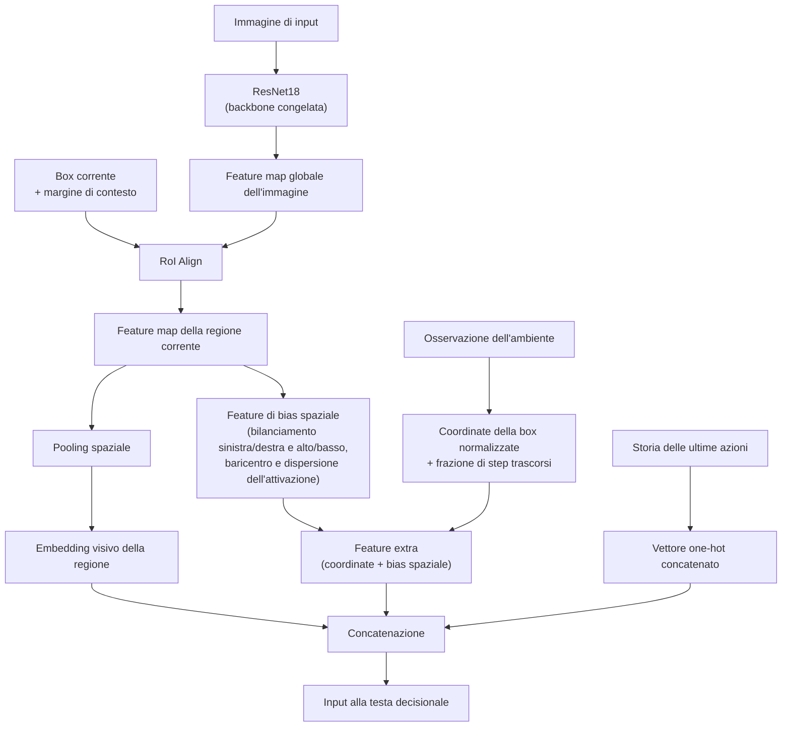
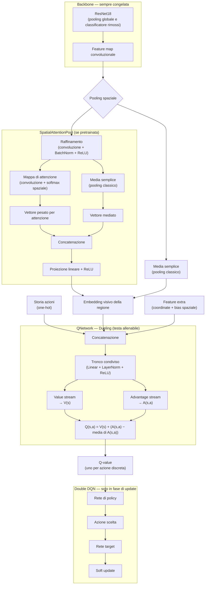

# Localizzazione di tumori cerebrali da MRI mediante Reinforcement Learning con Imitation Learning guidato

Relazione di Progetto di Sistemi Complessi: Modelli e Simulazione

Pina Lorenzo 894396 e Rancati Simone 900052

Repository GitHub: https://github.com/LorenzoPinaUnimib/segmentation_rl

---

## Abstract

Il progetto affronta il problema della localizzazione di tumori cerebrali in immagini di risonanza magnetica (MRI) formulandolo come un problema di decisione sequenziale: un agente osserva un'immagine e una bounding box corrente e, ad ogni passo, sceglie fra 9 azioni discrete per raffinare tale box fino a farla coincidere con la regione occupata dal tumore.

Il sistema combina un backbone convoluzionale pre-addestrato e congelato (ResNet18) con una testa decisionale Dueling Double DQN, addestrata mediante una combinazione di Curriculum Learning sulla soglia di successo e Imitation Learning guidato da un oracolo con ricerca ad albero.

Il reward è costruito a partire dalla metrica Complete Intersection over Union (CIoU), che fornisce segnale anche in assenza di sovrapposizione.

L'addestramento è ulteriormente stabilizzato da Prioritized Experience Replay, ritorni n-step, margin loss in stile DQfD e reward scaling adattivo.

---

\newpage

## Indice

1. [Introduzione](#1-introduzione)
2. [Lavori correlati](#2-lavori-correlati)
3. [Dataset](#3-dataset)
4. [Formulazione del problema come MDP](#4-formulazione-del-problema-come-mdp)
5. [Rappresentazione dello stato](#5-rappresentazione-dello-stato)
6. [Architettura del modello](#6-architettura-del-modello)
7. [Spazio delle azioni e dinamica dell'ambiente](#7-spazio-delle-azioni-e-dinamica-dellambiente)
8. [Metriche di sovrapposizione](#8-metriche-di-sovrapposizione)
9. [Reward shaping](#9-reward-shaping)
10. [Meccanismi di stabilizzazione dell'apprendimento](#10-meccanismi-di-stabilizzazione-dellapprendimento)
11. [Strategie di addestramento](#11-strategie-di-addestramento)
12. [Setup sperimentale](#12-setup-sperimentale)
13. [Risultati](#13-risultati)
14. [Analisi e discussione](#14-analisi-e-discussione)
15. [Limiti e sviluppi futuri](#15-limiti-e-sviluppi-futuri)
16. [Conclusioni](#16-conclusioni)
17. [Bibliografia](#17-bibliografia)

---

\newpage

## 1. Introduzione

### 1.1 Contesto e motivazioni

La localizzazione automatica di lesioni tumorali in immagini MRI è un passo preliminare importante per la diagnosi assistita e per la successiva segmentazione fine. Gli approcci classici basati su object detection richiedono tipicamente grandi quantità di dati annotati e non modellano esplicitamente il processo incrementale con cui un radiologo affina progressivamente l'attenzione su una regione sospetta.

Un filone di letteratura alternativo propone di trattare la localizzazione come un problema di decisione sequenziale: un agente osserva lo stato corrente (immagine + box) e impara, tramite tentativi ed errori, una politica di trasformazioni elementari della box che la avvicinano iterativamente alla regione target.

Questo paradigma è particolarmente interessante in ambito medicale, dove i dataset sono spesso di dimensioni limitate, poiché consente di sfruttare segnali di reward e dimostrazioni di un esperto (Imitation Learning) per accelerare l'apprendimento.

### 1.2 Obiettivi

Il progetto si pone l'obiettivo di progettare, implementare e valutare un agente basato su Deep Q-Network in grado di localizzare tumori cerebrali su MRI 2D.

Durante lo svolgimento del progetto ci siamo occupati di integrare varie tecniche note della letteratura RL in un'unica pipeline applicata a un dominio medicale, con l'obiettivo di valutarne l'effetto complessivo su un compito di localizzazione con dataset di dimensioni contenute.

---

\newpage

## 2. Lavori correlati (da rivedere)

L'idea di trattare la localizzazione visiva come una sequenza di azioni discrete su una bounding box è stata introdotta in ambito RL da lavori come quello di Caicedo e Lazebnik [4], che utilizzano un agente Q-learning per muovere/ridimensionare una box su immagini naturali (dataset Pascal VOC). Stember e Shalu [1, 3] applicano un'idea analoga alla localizzazione di lesioni cerebrali su MRI, dimostrando che è possibile ottenere buone prestazioni anche con training set molto piccoli grazie al segnale denso fornito dal reward shaping. Ding et al. [2] estendono l'approccio RL alla segmentazione medicale vera e propria (non solo bounding box).

Sul piano architetturale, questo progetto attinge a tre filoni distinti della letteratura RL "classica": le architetture Dueling [5], che separano la stima del valore dello stato da quella del vantaggio relativo di ciascuna azione; il Double Q-learning [6], che riduce la sovrastima dei Q-value disaccoppiando selezione e valutazione dell'azione greedy; e il Prioritized Experience Replay [7], che campiona con probabilità proporzionale all'errore TD le transizioni più "informative". Il meccanismo di imitation learning guidato da un oracolo è ispirato al framework DQfD (Deep Q-learning from Demonstrations) [8], che combina una loss TD standard con una margin loss che spinge i Q-value delle azioni dimostrate dall'esperto ad essere superiori di un margine fisso rispetto alle alternative. Infine, per il reward shaping il progetto adotta metriche di sovrapposizione più informative della IoU classica, in particolare GIoU [11] e DIoU/CIoU [10], originariamente proposte come funzioni di loss per la regressione di bounding box in task di object detection.

---

## 3. Dataset

È stato utilizzato il dataset [Brain Tumor Image DataSet: Semantic Segmentation](https://www.kaggle.com/datasets/pkdarabi/brain-tumor-image-dataset-semantic-segmentation), contenente 2146 immagini derivate da scansioni MRI di cervelli con tumori, suddivise in:

| Split | Immagini | Frazione |
|---|---|---|
| Training | 1502 | ≈ 70% |
| Validation | 429 | ≈ 20% |
| Test | 215 | ≈ 10% |

Ogni immagine è associata a una bounding box, usata sia come ground-truth per il calcolo della reward sia come riferimento per l'oracolo che guida l'Imitation Learning.

### 3.1 Preprocessing

Le immagini vengono ridimensionate a una risoluzione fissa di 224×224×3 pixel, coerente con l'input atteso dalla backbone ResNet18. 

Per ogni immagine viene eseguita la normalizzazione (min-max) e la maschera viene binarizzata con soglia 0.5.

> 🔲 Placeholder — Tabella 1. Statistiche descrittive delle dimensioni delle box di ground truth (area media, area mediana, rapporto larghezza/altezza) calcolate sul training set.

---

\newpage

## 4. Formulazione del problema come MDP

Il processo di localizzazione è modellato come un Markov Decision Process (MDP) definito dalla tupla $(\mathcal{S}, \mathcal{A}, T, R, \gamma)$:

- Spazio degli stati $\mathcal{S}$: l'osservazione a ogni istante $t$ è composta dall'immagine, dalla regione di interesse attorno alla box corrente (con contesto), dalla storia delle ultime azioni e da un vettore di feature ausiliarie (coordinate normalizzate della box, frazione di step trascorsi, feature di bias spaziale).
- Spazio delle azioni $\mathcal{A}$: 9 azioni discrete che modificano la box (traslazioni, ridimensionamenti, stop).
- Dinamica di transizione $T$: deterministica data l'azione poiché la nuova box è ottenuta applicando una trasformazione geometrica fissa (soggetta a vincoli) alla box corrente.
- Funzione di reward $R$: combina una componente di miglioramento incrementale (basata su $\Delta CIoU$), una penalità di step e un bonus / penalità di terminazione.
- Fattore di sconto $\gamma = 0.98$.

L'episodio inizia con la box impostata pari all'intera immagine ($x_1=y_1=0$, $x_2=W$, $y_2=H$), fornendo un punto di partenza da cui l'agente deve progressivamente restringere l'attenzione.

L'episodio termina quando l'agente seleziona l'azione di stop (terminazione) oppure quando viene raggiunto un numero massimo di 50 passi senza stop (troncamento).

L'ambiente è implementato in forma vettorizzata, simulando in parallelo un intero batch di episodi indipendenti sulla stessa GPU/dispositivo, per efficienza computazionale.

---

\newpage

## 5. Rappresentazione dello stato

Lo stato osservato dall'agente ad ogni step è costruito da quattro componenti concatenate prima di entrare nella rete decisionale:

1. Embedding visivo della regione corrente. Anziché ricalcolare l'intera CNN sulla porzione di immagine ritagliata ad ogni step, la feature map globale dell'immagine viene calcolata una sola volta per episodio e, ad ogni step, la regione corrispondente alla box corrente (allargata di un margine di contesto di 16 pixel su ciascun lato) viene estratta direttamente dalla feature map tramite RoI Align (che mappa le coordinate in pixel alla griglia 7×7 prodotta dal backbone). Questo riduce drasticamente il costo computazionale per episodio rispetto a un forward completo del backbone ad ogni passo.
2. Storia delle azioni. Le ultime 10 azioni sono mantenute come vettore one-hot concatenato (dimensione $10 \times 9 = 90$) per dare all'agente memoria del proprio comportamento recente.
3. Feature di coordinate/progresso (5 valori): le coordinate $(x_1, y_1, x_2, y_2)$ della box corrente normalizzate rispetto a larghezza / altezza dell'immagine, più la frazione di step già trascorsi rispetto al massimo consentito.
4. Feature di bias spaziale (6 valori): calcolate direttamente dalla feature map prima del pooling globale, misurano dove si concentra l'energia dell'attivazione all'interno del crop corrente: bilanciamento sinistra/destra, bilanciamento alto/basso, baricentro normalizzato dell'attivazione (in orizzontale e in verticale) e dispersione attorno al baricentro (in orizzontale e in verticale). Queste feature non richiedono parametri allenabili e forniscono all'agente un segnale esplicito su "dove" nel crop si trova probabilmente il contenuto rilevante, invece di lasciare che lo infierisca solo indirettamente dall'embedding globale collassato.

La dimensione totale del vettore di coordinate / contesto è quindi di 11 valori (5 di coordinate / progresso più 6 di bias spaziale).

Figura 2. Schema a blocchi della pipeline di osservazione:

---

\newpage

## 6. Architettura del modello

### 6.1 Backbone

Come estrattore di feature viene impiegata una ResNet18, con lo strato di pooling globale e il classificatore finale rimossi (sostituiti da uno strato identità), mantenendo esclusivamente la porzione convoluzionale.

La backbone può essere inizializzata con i pesi pre-addestrati su ImageNet oppure con un checkpoint custom pre-addestrato specificamente sul dominio (tramite uno script di pre-addestramento esterno).

La backbone è interamente congelata: solo la testa decisionale viene aggiornata durante il RL, per limitare il numero di parametri allenabili e la possibilità di overfitting dato il dataset di dimensioni contenute.

### 6.2 Pooling spaziale: attenzione vs. media

La feature map prodotta dalla backbone (canali $512 \times 7 \times 7$ per un crop $224\times224$) viene ridotta a un vettore mediante  SpatialAttentionPool: un modulo che raffina la feature map con una convoluzione $3\times3$ + BatchNorm + ReLU, calcola una mappa di attenzione tramite convoluzione $1\times1$ seguita da softmax spaziale, produce un vettore pesato per attenzione che viene concatenato al vettore mediato classicamente, e infine proietta la concatenazione tramite un layer lineare + ReLU nello spazio di embedding finale (di dimensione 512). L'idea è combinare un riassunto generico (media) con uno selettivo (attenzione), lasciando alla rete la possibilità di enfatizzare le regioni più informative del crop.

### 6.3 Testa decisionale: Dueling DQN

La rete decisionale (QNetwork) riceve in input la concatenazione di embedding visivo, storia delle azioni e feature di coordinate/bias spaziale, e la elabora con un tronco condiviso (due blocchi Linear + LayerNorm + ReLU, dimensione nascosta 512), da cui si diramano due teste distinte:

- Value stream: stima $V(s)$, il valore scalare dello stato indipendentemente dall'azione;
- Advantage stream: stima $A(s,a)$, il vantaggio relativo di ciascuna delle 9 azioni.

I Q-value finali sono ricombinati secondo la formulazione standard che garantisce identificabilità:

$$
Q(s,a) = V(s) + \left(A(s,a) - \frac{1}{|\mathcal{A}|}\sum_{a'} A(s,a')\right)
$$

Questa separazione consente alla rete di apprendere il valore dello stato anche in situazioni in cui la scelta dell'azione specifica ha scarso impatto, migliorando tipicamente stabilità e velocità di apprendimento.

### 6.4 Target network e Double DQN

Per stabilizzare il bootstrap del target TD viene mantenuta una rete target, copia della rete di policy, aggiornata mediante soft update ad ogni step di ottimizzazione:

$$
\theta_{\text{target}} \leftarrow (1-\tau)\,\theta_{\text{target}} + \tau\,\theta_{\text{policy}}
$$

Per ridurre la sovrastima sistematica tipica del Q-learning standard, la selezione dell'azione migliore per lo stato successivo avviene con la rete di policy (in modalità di valutazione), mentre la sua valutazione (il relativo Q-value) è ottenuta dalla rete target:

$$
a^{*} = \arg\max_{a'} Q_{\text{policy}}(s', a'), \qquad y = r + \gamma^{n}\, Q_{\text{target}}(s', a^{*}) \cdot (1-\text{done})
$$

Figura 3. Diagramma dell'architettura completa:

---

\newpage

## 7. Spazio delle azioni e dinamica dell'ambiente

L'agente dispone di 9 azioni discrete:

| # | Azione |
|---|---|
| 0 | Spostamento a destra |
| 1 | Spostamento a sinistra |
| 2 | Spostamento in alto |
| 3 | Spostamento in basso |
| 4 | Restringimento orizzontale |
| 5 | Restringimento verticale |
| 6 | Espansione orizzontale |
| 7 | Espansione verticale |
| 8 | Stop (trigger) |

L'entità degli spostamenti e dei ridimensionamenti è proporzionale alla dimensione corrente della box (pari al 10% di larghezza/altezza), con un valore minimo assoluto in pixel per evitare passi degeneri quando la box è già molto piccola. Questo rende i movimenti via via più fini man mano che la box si restringe attorno al target.

Ogni trasformazione è vincolata in modo che:
- la box risultante non esca mai dai limiti dell'immagine;
- la larghezza e l'altezza non scendano sotto una soglia minima di 5 pixel, per evitare il collasso della box.

---

\newpage

## 8. Metriche di sovrapposizione

Il sistema calcola, ad ogni step, quattro metriche di sovrapposizione tra la box predetta $B$ e quella di ground truth $B^{gt}$, usate rispettivamente per il reward shaping e per la valutazione.

### 8.1 Intersection over Union (IoU)

$$
\text{IoU}(B, B^{gt}) = \frac{\text{Area}(B \cap B^{gt})}{\text{Area}(B \cup B^{gt})} \in [0, 1]
$$

Limite noto della IoU: quando le due box non si intersecano, IoU $= 0$ indipendentemente da quanto siano vicine o lontane, fornendo un gradiente non informativo.

### 8.2 Generalized IoU (GIoU)

$$
\text{GIoU} = \text{IoU} - \frac{\text{Area}(C) - \text{Area}(B \cup B^{gt})}{\text{Area}(C)}
$$

dove $C$ è il più piccolo rettangolo che racchiude sia $B$ che $B^{gt}$. La GIoU introduce un termine di penalità basato sull'area sprecata del box che racchiude entrambe le box, restando informativa anche a intersezione nulla.

### 8.3 Distance IoU (DIoU)

$$
\text{DIoU} = \text{IoU} - \frac{\rho^2(\mathbf{b}, \mathbf{b}^{gt})}{c^2}
$$

dove $\rho(\cdot)$ è la distanza euclidea tra i centri delle due box e $c$ è la diagonale del più piccolo rettangolo che le racchiude entrambe. Penalizza direttamente la distanza tra i centri, favorendo una convergenza più diretta rispetto a GIoU.

### 8.4 Complete IoU (CIoU)

$$
\text{CIoU} = \text{IoU} - \frac{\rho^2(\mathbf{b}, \mathbf{b}^{gt})}{c^2} - \alpha v
$$

con $v$ termine di penalità sulla differenza tra i rapporti larghezza/altezza delle due box e $\alpha$ un peso calcolato dinamicamente (senza gradiente) in funzione di $v$ e della IoU corrente:

$$
v = \frac{4}{\pi^2}\left(\arctan\frac{w^{gt}}{h^{gt}} - \arctan\frac{w}{h}\right)^2, \qquad
\alpha = \frac{v}{(1 - \text{IoU}) + v}
$$

La CIoU combina quindi tre criteri di sovrapposizione (area, distanza dei centri, similarità di forma) in un unico segnale continuo e differenziabile, risultando la metrica più informativa tra quelle implementate anche quando l'intersezione è nulla: per questo è stata scelta come base del reward shaping.

---

\newpage

## 9. Reward shaping

Il reward è progettato per guidare l'agente sia verso un miglioramento continuo della sovrapposizione, sia verso una terminazione tempestiva e accurata.

### 9.1 Ricompensa per miglioramento incrementale

Ad ogni step viene premiata la variazione di CIoU tra lo stato corrente e quello precedente:

$$
\Delta\text{CIoU}_t = \text{CIoU}_t - \text{CIoU}_{t-1}
$$

$$
r^{\text{move}}_t = 5 \cdot \Delta\text{CIoU}_t
$$

### 9.2 Penalità per step

Per scoraggiare episodi inutilmente lunghi e favorire l'efficienza:

$$
r^{\text{step}} = -0.02
$$

### 9.3 Ricompensa/penalità di terminazione e troncamento

L'episodio termina quando l'agente seleziona l'azione di stop.

Alla terminazione viene aggiunto un bonus proporzionale a quanto la IoU finale supera (o non raggiunge) la soglia di successo variabile tramite Curriculum Learning:

$$
r^{\text{term}} = 10 \cdot (\text{IoU}_T - \tau \text{IoU})
$$

Se invece l'episodio viene troncato (limite di 50 passi raggiunto senza selezionare stop), viene applicata la stessa formula con un'ulteriore penalità fissa:

$$
r^{\text{trunc}} = r^{\text{term}} - 2
$$

Questa struttura incentiva l'agente a fermarsi quando la sovrapposizione è già buona e lo penalizza sia per uno stop prematuro con IoU bassa, sia per il mancato raggiungimento di una decisione.

### 9.4 Clipping e scaling

Il reward totale per lo step è la somma delle componenti precedenti ed è limitato nell'intervallo $[-10, 10]$ per evitare aggiornamenti instabili dovuti a valori anomali.

Prima di essere inserito nel replay buffer, il reward viene inoltre normalizzato in ampiezza da uno scaler a media / varianza mobile (aggiornato online), dividendo per la deviazione standard corrente stimata sui reward osservati: una forma di reward scaling che stabilizza la scala dei target TD indipendentemente dal punto dell'addestramento.

---

\newpage

## 10. Meccanismi di stabilizzazione dell'apprendimento

Oltre a Dueling DQN, Double DQN e target network già descritti, la pipeline di addestramento integra diversi accorgimenti standard nella letteratura RL per rendere l'apprendimento più stabile e campione-efficiente su un dataset di dimensioni contenute:

### 10.1 Prioritized Experience Replay (PER)

Il replay buffer (EmbeddingReplayBuffer) memorizza, per ciascuna transizione, l'embedding visivo (anziché l'immagine grezza, per risparmiare memoria), la storia delle azioni, le feature extra, azione, reward, flag di terminazione e un'etichetta per distinguere le transizioni suggerite dall'oracolo.

Il campionamento non è uniforme ma prioritizzato: la probabilità di estrarre una transizione è proporzionale al suo errore TD assoluto elevato a un esponente $\alpha$ (pari a 0.6):

$$
P(i) = \frac{p_i^{\alpha}}{\sum_k p_k^{\alpha}}, \qquad p_i = |\delta_i| + \varepsilon
$$

Per correggere il bias introdotto dal campionamento non uniforme, ogni transizione campionata viene pesata nella loss con un fattore di importance sampling, il cui esponente $\beta$ cresce linearmente da 0.4 a 1.0 nel corso del training:

$$
w_i = \left(N \cdot P(i)\right)^{-\beta}, \quad \text{normalizzati per } \max_i w_i
$$

### 10.2 Ritorni n-step

Anziché un bootstrap a singolo step, le transizioni sono accumulate in code per-episodio e combinate in ritorni n-step (con un orizzonte di 50 passi, pari al limite massimo di step per episodio):

$$
R_t^{(n)} = \sum_{i=0}^{n-1} \gamma^i r_{t+i}, \qquad y = R_t^{(n)} + \gamma^n Q_{\text{target}}(s_{t+n}, a^*) \cdot (1-\text{done})
$$

con interruzione anticipata della somma se un episodio termina prima di $n$ step. Il ritorno n-step propaga il segnale di reward più rapidamente attraverso la sequenza di stati, riducendo la varianza del bootstrap in problemi con reward sparso o ritardato.

### 10.3 Funzione di loss

La loss TD è calcolata con Huber loss, meno sensibile agli outlier rispetto all'errore quadratico medio, pesata per i pesi di importance sampling del PER:

$$
\mathcal{L}_{\text{TD}} = \mathbb{E}\left[w_i \cdot \text{SmoothL1}\big(Q(s_i,a_i) - y_i\big)\right]
$$

Gli errori TD vengono poi utilizzati per aggiornare le priorità delle transizioni appena campionate. Il gradiente è ristretto alla sola testa decisionale della rete (backbone e pooling spaziale restano sempre congelati) e viene applicato gradient clipping (norma massima 10) prima dello step di ottimizzazione.

---

\newpage

## 11. Strategie di addestramento

### 11.1 Reinforcement Learning puro

L'agente apprende esclusivamente dall'interazione con l'ambiente e dal segnale di reward, senza guida esterna, selezionando le azioni con una politica $\varepsilon$-greedy rispetto ai Q-value correnti. $\varepsilon$ decresce linearmente da 1.0 a 0.05 nella prima metà del training.

### 11.2 Curriculum Learning sulla soglia di successo

La soglia di IoU richiesta per considerare "corretto" un trigger (usata sia dall'oracolo per decidere quando fermarsi sia come criterio di successo interno all'ambiente) non è fissa ma segue un curriculum: parte da un valore più permissivo (0.6) e cresce linearmente fino al valore obiettivo (0.8) entro una frazione configurabile delle epoche totali (pari al 60%). L'idea è permettere all'agente di consolidare prima una politica di localizzazione approssimativa, per poi essere gradualmente spinto verso una precisione maggiore.

### 11.3 Imitation Learning guidato da un oracolo con lookahead

Ad ogni epoca, con probabilità decrescente (stesso schema di decadimento lineare di $\varepsilon$, con un valore minimo residuo), l'azione eseguita non è quella scelta dalla policy ma quella suggerita da un oracolo. L'oracolo non si limita a un criterio greedy a un passo, ma esegue una ricerca ad albero (lookahead planning) di profondità configurabile (pari a 3 passi): per ciascuna delle 8 azioni di movimento candidate, simula ricorsivamente le conseguenze fino alla profondità massima consentita (o fino al raggiungimento della soglia di successo, o del budget di step residuo), valutando ciascun nodo con la CIoU e propagando all'indietro il massimo valore raggiungibile dai figli (schema di tipo *best-first / minimax degenere* senza avversario). L'azione radice scelta è quella che massimizza il valore atteso a fine ricerca; se la IoU corrente è già sopra soglia, l'oracolo restituisce direttamente l'azione di stop.

Le transizioni generate mentre l'agente è guidato dall'oracolo vengono marcate con un'etichetta di provenienza esperta, utilizzata sia per il salvataggio nel replay buffer sia per la margin loss descritta di seguito.

### 11.4 Esplorazione epsilon-greedy residuale

Quando una transizione non è guidata dall'oracolo, l'azione è comunque soggetta a esplorazione $\varepsilon$-greedy standard: con probabilità $\varepsilon$ viene scelta un'azione casuale uniforme fra le 9 disponibili, altrimenti l'azione greedy della policy corrente. Questo garantisce che l'agente continui a esplorare autonomamente anche nelle fasi in cui il teacher è ancora relativamente presente.

### 11.5 Margin loss in stile DQfD

Per le transizioni marcate come provenienti dall'oracolo, alla loss TD viene sommato un termine di margin loss ispirato a DQfD [8], che spinge il Q-value dell'azione dimostrata dall'oracolo ad essere superiore di almeno un margine fisso (pari a 0.8) rispetto a quello di qualunque altra azione:

$$
\mathcal{L}_{\text{margin}} = \mathbb{E}_{i \in \text{expert}}\left[\max_{a}\Big(Q(s_i,a) + \ell(a_E, a)\Big) - Q(s_i, a_E)\right], \qquad \ell(a_E,a) = \begin{cases} 0 & a = a_E \\ m & a \neq a_E \end{cases}
$$

$$
\mathcal{L} = \mathcal{L}_{\text{TD}} + \lambda_{\text{DQfD}} \cdot \mathcal{L}_{\text{margin}}
$$

Questo termine accelera l'apprendimento imitativo delle azioni suggerite dall'oracolo, complementando il segnale, più lento, propagato dalla sola loss TD.

> 🔲 Placeholder — Figura 5. Andamento nel tempo della probabilità di guida dell'oracolo, del tasso di esplorazione e della soglia di successo durante il curriculum (grafico a tre curve sovrapposte, da TensorBoard).

---

## 12. Setup sperimentale

| Iperparametro | Valore |
|---|---|
| Numero di epoche | 150 |
| Batch size (episodi paralleli) | 32 |
| Learning rate | 1e-4 |
| Ottimizzatore | Adam (con weight decay 1e-4) |
| Discount factor $\gamma$ | 0.98 |
| Step massimi per episodio | 50 |
| Dimensione embedding | 512 |
| Lunghezza storia azioni | 10 |
| Capacità replay buffer | 100.000 transizioni |
| PER $\alpha$ / $\beta$ (start→end) | 0.6 / 0.4 → 1.0 |
| N-step | 50 |
| $\varepsilon$ (start→end) | 1.0 → 0.05 |
| $\tau_{IoU}$ (start→target, curriculum) | 0.6 → 0.8 |
| Margine DQfD | 0.8 |
| Target network $\tau$ (soft update) | 0.01 |
| Reward clipping | ±10 |
| Soglia di successo (reward terminazione) | 0.6 |
| Soglia di successo (valutazione IoU) | 0.6 |

L'addestramento è monitorato tramite TensorBoard, con log per-step (IoU/GIoU/DIoU correnti, $\varepsilon$, probabilità di guida dell'oracolo, deviazione standard del reward scaler) e per-epoca (metriche finali e "migliori durante l'episodio" di training e validation, loss media, success rate). I checkpoint includono lo stato di policy network, target network, ottimizzatore, scheduler e reward scaler, per consentire la ripresa dell'addestramento.

---

## 13. Risultati

Dopo l'addestramento per 150 epoche (batch da 32 immagini per epoca), si osservano i seguenti andamenti qualitativi:

- la reward di training parte da valori elevati, sostenuta dalla forte presenza del teacher nelle prime epoche, decresce progressivamente fino a circa l'epoca 50 (man mano che la probabilità di guida dell'oracolo scende e l'agente è "lasciato solo"), per poi risalire e assestarsi attorno a un valore prossimo a 2;
- la reward di validation parte invece da valori negativi (circa −3, coerentemente con un agente ancora poco addestrato e privo di guida del teacher in valutazione) e cresce monotonicamente nel corso delle epoche, raggiungendo una media di circa 1.5;
- la IoU media in validation si assesta, verso la fine dell'addestramento, attorno al 55%.

> 🔲 Placeholder — Figura 6. Curva della reward media di training vs. epoca (dal log TensorBoard corrispondente).

> 🔲 Placeholder — Figura 7. Curva della reward media di validation vs. epoca (dai log TensorBoard corrispondenti).

> 🔲 Placeholder — Figura 8. Curva della IoU media (finale e migliore durante l'episodio) di validation vs. epoca.

> 🔲 Placeholder — Tabella 3. Metriche finali sul test set, generate dalla procedura di test (colonne: IoU media±dev.std./max, GIoU, DIoU, reward totale, numero di step medio, success rate a soglia 0.6, percentuale di episodi terminati con trigger esplicito vs. troncati) — da compilare a partire dal file riassuntivo dei risultati di test.

> 🔲 Placeholder — Figura 9. Esempi qualitativi di traiettorie dell'agente (sequenza di box durante un episodio) su 2–3 immagini di test, incluso almeno un caso di successo e un caso di fallimento.

---

## 14. Analisi e discussione

Il calo iniziale della reward di training tra le epoche 0–50 è coerente con l'atteso: mentre la probabilità di guida dell'oracolo decresce, l'agente perde progressivamente il supporto dell'oracolo e deve fare maggiore affidamento sulla propria politica, ancora poco raffinata, generando episodi meno efficienti (più step, terminazioni premature o tardive). La successiva ripresa suggerisce che il segnale TD, combinato con il curriculum sulla soglia di successo e con la margin loss DQfD sulle transizioni residue dell'oracolo, sia sufficiente a consolidare una politica autonoma via via più competente.

Il gap iniziale negativo della reward di validation (assente in training grazie al teacher) evidenzia correttamente la differenza fra prestazioni "assistite" e prestazioni della sola policy appresa: è la metrica più onesta per giudicare il reale progresso dell'agente, ed è positivo che converga a un valore comparabile a quello di training.

Un valore di IoU media attorno al 55% è ragionevole considerando: (i) la risoluzione discreta e relativamente grossolana dei movimenti disponibili (passi proporzionali al 10% della dimensione corrente, con soglia minima assoluta), che limita la precisione fine raggiungibile; (ii) l'eterogeneità del dataset, che include presumibilmente casi con tumori molto piccoli o dai contorni poco definiti, più difficili da localizzare con un bounding box.

> 🔲 Placeholder — Analisi aggiuntiva. Confronto tra le run con e senza componenti (ablation): PER on/off, DQfD margin on/off, curriculum tau on/off, spatial attention vs. average pooling — da inserire se sono disponibili i log delle run comparative corrispondenti (eseguite disattivando singolarmente ciascun componente).

---

## 15. Limiti e sviluppi futuri

- Immagini 2D: il sistema opera su singole slice MRI; un'estensione a volumi 3D (o a sequenze di slice) potrebbe sfruttare informazione di contesto assiale aggiuntiva.
- Singola box per immagine: l'ambiente assume un solo tumore/regione di interesse per immagine; casi multi-lesione richiederebbero un'estensione dello spazio delle azioni o un meccanismo multi-agente/multi-box.

---

## 16. Conclusioni

Il progetto formula la localizzazione di tumori cerebrali su MRI come un problema di decisione sequenziale (MDP), risolto tramite un agente Dueling Double DQN che opera su una rappresentazione dello stato efficiente basata su RoI Align e attenzione spaziale. Il reward shaping, costruito sulla metrica CIoU integrata con la IoU pura, fornisce un segnale denso e informativo anche in assenza di sovrapposizione iniziale, mentre il curriculum sulla soglia di successo e l'imitation learning guidato da un oracolo con lookahead accelerano e stabilizzano l'apprendimento, in sinergia con Prioritized Experience Replay, ritorni n-step e margin loss in stile DQfD. I risultati ottenuti (IoU media di validation prossima al 55%, reward di validation in crescita costante) confermano l'efficacia complessiva dell'approccio, pur lasciando margine di miglioramento legato alla variabilità del dataset. Il lavoro dimostra, più in generale, come l'integrazione mirata di più tecniche consolidate della letteratura RL (Dueling, Double DQN, PER, DQfD, reward shaping basato su metriche di IoU generalizzate) possa produrre una pipeline solida e addestrabile anche su dataset medicali di dimensioni contenute.

---

## 17. Bibliografia

Applicazioni RL alla localizzazione/segmentazione medicale e visiva

1. Stember, J.N., Shalu, H. *Reinforcement learning using Deep networks and learning accurately localizes brain tumors on MRI with very small training sets* (2022). DOI: 10.1186/s12880-022-00919-x
2. Ding, Y., Qin, X., Zhang, M., Geng, J., Chen, D., Deng, F., Song, C. *RLSegNet: A Medical Image Segmentation Network Based on Reinforcement Learning* (2023). IEEE/ACM Transactions on Computational Biology and Bioinformatics. DOI: 10.1109/TCBB.2022.3195705
3. Stember, J.N., Shalu, H. *Deep reinforcement learning to detect brain lesions on MRI: a proof-of-concept application of reinforcement learning to medical images* (2020). arXiv:2008.02708
4. Caicedo, J.C., Lazebnik, S. *Active Object Localization with Deep Reinforcement Learning* (2015). ICCV. arXiv:1511.06015

Componenti algoritmiche del Deep Reinforcement Learning

5. Wang, Z., Schaul, T., Hessel, M., van Hasselt, H., Lanctot, M., de Freitas, N. *Dueling Network Architectures for Deep Reinforcement Learning* (2016). ICML. arXiv:1511.06581
6. van Hasselt, H., Guez, A., Silver, D. *Deep Reinforcement Learning with Double Q-learning* (2016). AAAI. arXiv:1509.06461
7. Schaul, T., Quan, J., Antonoglou, I., Silver, D. *Prioritized Experience Replay* (2016). ICLR. arXiv:1511.05952
8. Hester, T. et al. *Deep Q-learning from Demonstrations* (2018). AAAI. arXiv:1704.03732
9. Hessel, M., Modayil, J., van Hasselt, H., Schaul, T., Ostrovski, G., Dabney, W., Horgan, D., Piot, B., Azar, M., Silver, D. *Rainbow: Combining Improvements in Deep Reinforcement Learning* (2018). AAAI. arXiv:1710.02298

Metriche e loss per bounding box

10. Zheng, Z., Wang, P., Liu, W., Li, J., Ye, R., Ren, D. *Distance-IoU Loss: Faster and Better Learning for Bounding Box Regression* (2020). AAAI. arXiv:1911.08287
11. Rezatofighi, H., Tsoi, N., Gwak, J., Sadeghian, A., Reid, I., Savarese, S. *Generalized Intersection over Union: A Metric and A Loss for Bounding Box Regression* (2019). CVPR. arXiv:1902.09630
12. He, K., Gkioxari, G., Dollár, P., Girshick, R. *Mask R-CNN* (2017). ICCV. (introduce RoI Align) arXiv:1703.06870

---

> Nota per la compilazione finale. I blocchi contrassegnati con 🔲 sono placeholder da sostituire con i grafici esportati da TensorBoard e con le tabelle numeriche ricavate dai file riassuntivi prodotti dalla procedura di test, prima della consegna della relazione definitiva.
